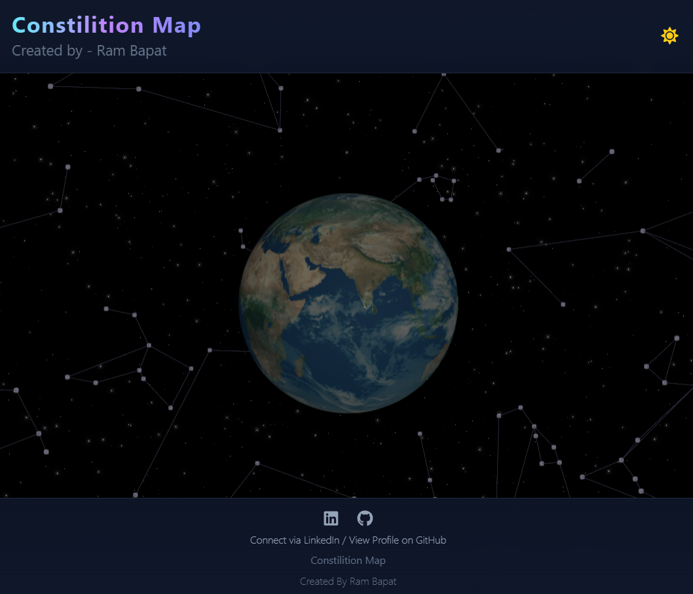
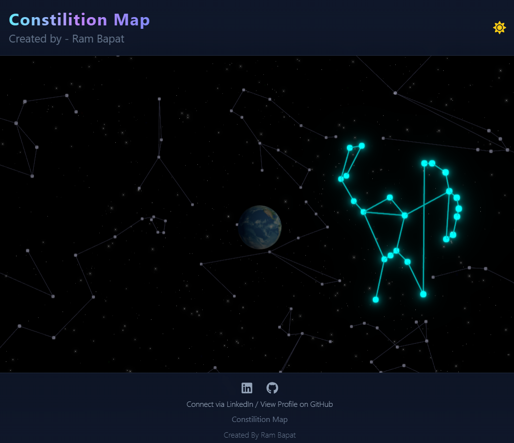
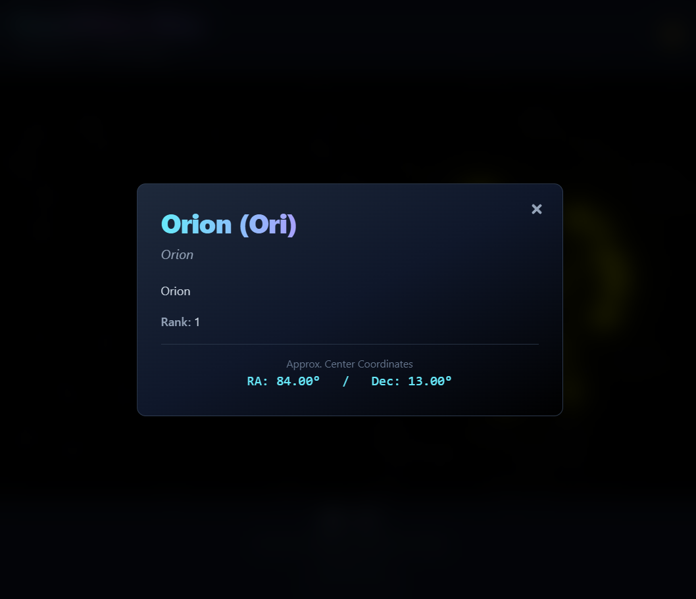

# Constellation Map: 3D Constellation Explorer ✨🌌🔭

## Try live demo - [Demo](https://constilition-map.vercel.app/)

An immersive and visually stunning 3D constellation viewer built with React, Vite, and Three.js (@react-three/fiber). Explore the night sky, hover over constellations to see their shapes illuminate, and click to learn more about them.

<!-- ================================================== -->







<!-- ================================================== -->

## Overview

Constellation Map offers an interactive journey through the cosmos right from your browser. Centered around a beautifully textured 3D Earth model, the application renders a dynamic starfield and the major constellations.

Users can freely rotate, zoom, and pan the view. Hovering over the stars of a constellation reveals its familiar shape with highlighted lines and stars. Clicking on a constellation brings up an elegant modal window displaying its name, designation, English name, and other available details from the dataset.

This project emphasizes visual appeal with smooth animations, a dark/light theme toggle, gradient UI elements, and post-processing effects like bloom for a truly "epic" look. It serves as Day **Day 28** of my **#30DaysOfVibeCoding** challenge, showcasing how AI can assist in rapidly prototyping and building visually rich web experiences.

## Features

*   **Interactive 3D Globe:** Central rotating Earth model with day map, normal map, and cloud layer textures.
*   **Immersive Skybox:** Realistic panoramic space background.
*   **Dynamic Starfield:** Thousands of stars rendered using `@react-three/drei`.
*   **Constellation Data Rendering:** Displays stars and faint connecting lines for dozens of constellations based on astronomical data.
*   **Hover Interaction:** Smoothly highlights constellation stars and lines upon hover.
*   **Click Interaction:** Selects a constellation, keeping it highlighted.
*   **Detailed Information Modal:** Displays constellation details (Name, Designation, English Name, Rank, Coordinates) in an animated, styled modal (`framer-motion`).
*   **Theme Toggle:** Switch between default dark mode and a light mode theme.
*   **Visual Effects:** Utilizes bloom post-processing (`@react-three/postprocessing`) for glowing stars and highlights.
*   **Modern UI:** Sleek header and footer with gradients and backdrop blur effects using Tailwind CSS.
*   **Responsive Design:** Adapts to various screen sizes (desktop, tablet, mobile).
*   **Data-Driven:** Constellation positions, lines, and info loaded from local JSON files.
*   **Modern Tech Stack:** Built with React, Vite, `@react-three/fiber`, `@react-three/drei`, and Tailwind CSS.

## Tech Stack

*   **Frontend:** React 18+
*   **3D Rendering:** Three.js via:
    *   `@react-three/fiber` (React renderer for Three.js)
    *   `@react-three/drei` (Helpers for R3F)
    *   `@react-three/postprocessing` (Effects like Bloom)
    *   `postprocessing` (Core library)
*   **Build Tool:** Vite
*   **Styling:** Tailwind CSS v3
*   **Animation:** Framer Motion (for modal)
*   **Language:** JavaScript (ES6+)
*   **Icons:** `react-icons`
*   **Package Manager:** npm

## Getting Started

To get a local copy up and running, follow these simple steps.

### Prerequisites

*   Node.js (v18 or later recommended) installed on your system ([nodejs.org](https://nodejs.org/)). Includes npm.
*   Git (for cloning the repository).

### Installation & Setup

1.  **Clone the repository:**
    ```bash
    git clone https://github.com/Barrsum/Constellation-Map.git
    ```

2.  **Navigate to the project directory:**
    ```bash
    cd Constellation-Map
    ```

3.  **Install NPM packages:**
    *(Ensure you are using npm, or adapt if using yarn/pnpm)*
    ```bash
    npm install
    ```
    *(This uses the `package.json` with specific versions for compatibility)*

### Running the Project

1.  **Start the development server:**
    ```bash
    npm run dev
    ```
    This command will start the Vite development server.

2.  **Open the application:**
    Open your web browser and navigate to the local URL provided by Vite (usually `http://localhost:5173/`).

## Contributing

Contributions, issues, and feature requests are welcome! This was built as part of a rapid development challenge, so there's always room for improvement. Feel free to check the [issues page](https://github.com/Barrsum/Constilition-Map/issues).

1.  Fork the Project
2.  Create your Feature Branch (`git checkout -b feature/AmazingFeature`)
3.  Commit your Changes (`git commit -m 'Add some AmazingFeature'`)
4.  Push to the Branch (`git push origin feature/AmazingFeature`)
5.  Open a Pull Request

## License

Distributed under the MIT License. See `LICENSE.md` for more information.

## Acknowledgements

*   **Constellation Data & Lines:** Sourced from [github.com/ofrohn/d3-celestial](https://github.com/ofrohn/d3-celestial), under the BSD 3-Clause License.
*   **Earth Textures:** [The Celestia Motherlode](http://www.celestiamotherlode.net/)
*   **Skybox Texture:** Self Designed from [Paint Again](https://paint-again.vercel.app/) by [Ram Bapat](https://www.linkedin.com/in/ram-bapat-barrsum-diamos) / [Barrsum](https://github.com/Barrsum)
*   **Core Libraries:** [React](https://react.dev/), [Vite](https://vitejs.dev/), [Three.js](https://threejs.org/), [React Three Fiber](https://docs.pmnd.rs/react-three-fiber/), [React Three Drei](https://github.com/pmndrs/drei), [Postprocessing](https://github.com/pmndrs/postprocessing), [Tailwind CSS](https://tailwindcss.com/), [Framer Motion](https://www.framer.com/motion/), [React Icons](https://react-icons.github.io/react-icons/).

---

Built by **Ram Bapat** as part of the **[#30DaysOfVibeCoding Challenge](https://www.linkedin.com/posts/ram-bapat-barrsum-diamos_vibecoding-ai-machinelearning-activity-7312839191153860608-wQ8y?utm_source=share&utm_medium=member_desktop)** - [LinkedIn Profile](https://www.linkedin.com/in/ram-bapat-barrsum-diamos)
